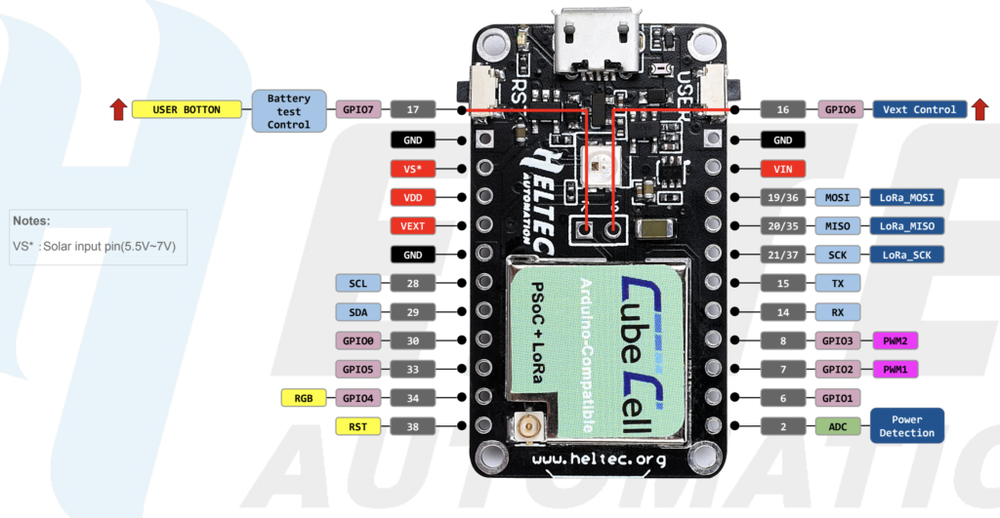

# Heltec CubeCell AB01 Ultrasonic

This folder contains the implementation with a [Heltec CubeCell](https://heltec.org/project/htcc-ab01/).

## 1. Backend Setup

For the backend setup please follow the instructions on the [main readme](https://github.com/jfehre/IoT-LoRa-Ultrasonic)

## 2. Install Libraries in Arduino IDE

1. Install the [CubeCell framework](https://heltec-automation-docs.readthedocs.io/en/latest/cubecell/quick_start.html) in Arduino (Installation with Boards Manager)

This is still under development...

## 3. Code Setup

This is still under development...

## 4. Wiring of the Ultrasonic Sensor

This is still under development...

## 5. Heltec CubeCell AB01 Pinout:

