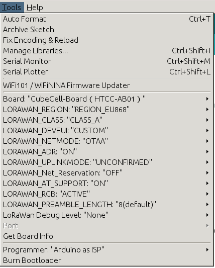

# Heltec CubeCell AB01 Ultrasonic

This folder contains the implementation with a [Heltec CubeCell](https://heltec.org/project/htcc-ab01/).

## 1. Backend Setup

For the backend setup please follow the instructions on the [main readme](https://github.com/jfehre/IoT-LoRa-Ultrasonic)

## 2. Install Libraries in Arduino IDE

1. Install the [CubeCell framework](https://docs.heltec.org/en/node/asr650x/htcc_ab01/quick_start.html) in Arduino (Installation with Boards Manager)

## 3. Code Setup
1. Copy the Template: `cp config.h.template config.h`. (This file is filled in with private data and should not be published)
2. Insert **Application EUI** (msb), **Device EUI** (msb) and **App Key** (msb) from the **Device Overview** in your [TheThingsNetwork](cloud.thethings.network) application to the `config.h` file. (Note: use the 'C-style' not Hex)
This is still under development...
3. *Optional*: Change in `config.h` the way how to read sensordata (UART/A02YYUW or Trig/Echo)
4. *Optional*: Change the pins in `config.h`
5. *Optional*: Change cycle time in `config.h`
6. Upload sketch to your board by using the `CubeCell-Board (HTCC AB01)` from Cube Cell

If you are using [Arduino IDE](https://www.arduino.cc/en/software) i have set following parameters in **Tools**:  

## 4. Wiring of the Ultrasonic Sensor

### UART (A02YYUW)
1. Connect `GND` of Sensor to `GND` of Board
2. Connect VCC of Sensor to either `3V3` or `5V` (if using a power pin, which is recommended, connect it to the corresponding pin in config, default `Vext`)
3. Connect `RX` of Sensor to PIN `GPIO1 (TX)` 
4. Connect `TX` of Sensor to PIN `GPIO2 (RX)`

[Sensor Information](https://wiki.dfrobot.com/_A02YYUW_Waterproof_Ultrasonic_Sensor_SKU_SEN0311) (The example code only works with `delay(100)`)

### Echo/Trig sensors (AJ-SR04M and HC-SR04)
1. Connect `GND` of Sensor to `GND` of Board
2. Connect VCC of Sensor to either `3V3` or `5V` (if using a power pin, connect it to the corresponding pin, default `Vext`)
3. Connect `Trig` of Sensor to PIN `GPIO5` 
4. Connect `Echo` of Sensor to PIN `GPIO4`

## 5. Heltec CubeCell AB01 Pinout:

## Information about Power Consumption
- To use full capacity of deep sleep you need to supply power over VDD (3.3V). By using USB connector the powerconsumption is a lot higher
- End all serial connections and power pins after use, so they will not drain power during consumption
- Using Vext as Power Pin, otherwise the board will not start with battery on VDD (3.3V) and sensor connected
- Board: active -> 30mA : deep sleep -> 3.3µA
