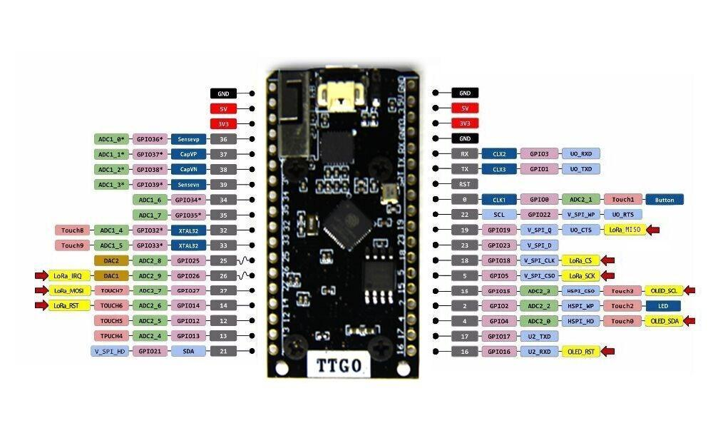

# Distance Measurement with TTGO ESP32 and ultrasonic sensor

This is an Arduino projekt for the [TTGO ESP32 LoRa](http://www.lilygo.cn/prod_view.aspx?TypeId=50003&Id=1141&FId=t3:50003:3) board in combination with an ultrasonic distance sensor. There are two implementations of communicating with ultrasonic sensors:

- **UART Serial:** (tested with the [waterproof ultrasonic sensor SKU (A02YYUW)](https://wiki.dfrobot.com/A02YYUW%20Waterproof%20Ultrasonic%20Sensor%20SKU:%20SEN0311) from dfrobot.)
- **Analog (Trig/Echo):**  (tested with the AJ-SR04M and HC-SR04 Sensors)

The script reads the measurement of the in the `config.h` specified sensor and sends the data over [The Things Network](https://www.thethingsnetwork.org/) to the [OpenSenseMap](https://opensensemap.org/).

## 1. Backend Setup

### 1.1 The Things Network
1. If you aren't already registered, [set up a The Things Network account](https://account.thethingsnetwork.org/register)
2. Create a new Application in TTN [Applications Console](https://console.thethingsnetwork.org/applications)
3. Add a new device for your new TTN application and select **OTAA Activation Method**
4. In your Application select **Payload Formats** and set it to `Cayenne LPP`
5. For the integration with [OpenSenseMap](https://opensensemap.org/), select **Integrations** in your Application and create a new **HTTP Integration**
6. Choose a unique 'Process ID' and set 'Access Key' to `default key`. For the 'URL' use `https://ttn.opensensemap.org/v1.1` as the endpoint and choose `POST` as the 'Method' . The remaining fields can be left out ([See here](https://osem.books.sensebox.de/de/ttn_integration.html)).

### 1.2 OpenSenseMap
1. If you aren't already registered, [set up a OpenSenseMap account](https://opensensemap.org/register)
2. In your **Dashboard** create a 'New senseBox'
3. Fill in the appropriate data like 'name', 'exposure type' and 'location'
4. Select 'Manual configuration' for your **Hardware** and 'Add sensor' with Phenomenon: `distance`, Unit: `mm` and Type: `ultrasonic`.
5. In **Advanced** choose 'TheThingsNetwork-TTN' and add `Cayenne LPP (beta)` as 'Decoding Profile'. Furthermore add your 'TTN Application-ID' and 'TTN Device-ID' from your [TheThingsNetwork application](https://console.thethingsnetwork.org/applications).
6. After your 'senseBox' is created edit it and go the **TheThingsNetwork** Settings.
7. In **Decoding Options** choose 'Cayenne LPP Phenomenon' as `Illumination` (to support floats with uint16) and if not already set, the 'Cayenne LPP Channel' to `1`.

## 2. Install Libraries in Arduino IDE
1. Install the [ESP32 Core for Arduino](https://github.com/espressif/arduino-esp32/blob/master/docs/arduino-ide/boards_manager.md) (Installation with Boards Manager)
2. Install the [LoRa](https://github.com/sandeepmistry/arduino-LoRa) library which supports the SX1276 Chip
3. Install [CayenneLPP](https://github.com/sabas1080/CayenneLPP) to package LoRa packets.
4. Install [Arduino-LMIC](https://github.com/mcci-catena/arduino-lmic) to send data over LoRaWan

## 3. ESP Setup
1. Copy the Template: `cp config.h.template config.h`. (This file is filled in with private data and should not be published)
2. Insert **Application EUI** (lsb), **Device EUI** (lsb) and **App Key** (msb) from the **Device Overview** in your [TheThingsNetwork application](https://console.thethingsnetwork.org/applications) to the `config.h` file. (Note: use the 'C-style' not Hex)
3. *Optional*: Change in `config.h` the way how to read sensordata (UART/A02YYUW or Trig/Echo)
4. *Optional*: Change the pins in `TTGO-ESP32-Ultrasonic.ino`
3. Upload sketch to your board by using the `TTGO LoRa32-OLED-V1` Board from the [ESP32 Core for Arduino](https://github.com/espressif/arduino-esp32/blob/master/docs/arduino-ide/boards_manager.md)

#### Notes:

- Maybe you need to change the 'Region Configuration' of the [Arduino-LMIC](https://github.com/mcci-catena/arduino-lmic) library. To change it, go to the `lmic_project_config.h` file within the LMIC Arduino library ([See here](https://github.com/mcci-catena/arduino-lmic#configuration)).
- When using **ABP Activation** instead of **OTAA Activation** the TTN application does not receive packages after a restart of the device. The option 'reset frame counters' in your TTN **Device Overview** helps ([see here](https://forum.sodaq.com/t/not-receiving-data-until-frame-counter-reset-in-ttn-console/632/3)).

## 4. Wiring of the Ultrasonic Sensor

### UART (A02YYUW)
1. Connect `GND` of Sensor to `GND` of Board
2. Connect VCC of Sensor to either `3V3` or `5V`
3. Connect `RX` of Sensor to PIN `17 (U2_TXD)` 
4. Connect `TX` of Sensor to PIN `16 (U2_RXD)`

You should also be able to use the other UART 1 connection of the board (Unforunately I'm not sure which PINs belong to the UART 1)

[Sensor Information](https://wiki.dfrobot.com/A02YYUW%20Waterproof%20Ultrasonic%20Sensor%20SKU:%20SEN0311)

### Echo/Trig sensors (AJ-SR04M and HC-SR04)
1. Connect `GND` of Sensor to `GND` of Board
2. Connect VCC of Sensor to either `5V`
3. Connect `Trig` of Sensor to PIN `13 (GPIO)` 
4. Connect `Echo` of Sensor to PIN `12 (GPIO)`

You can also use other GPIO pins which are not used internally by the board

## 5. TTGO ESP32 LoRa Pinout:

